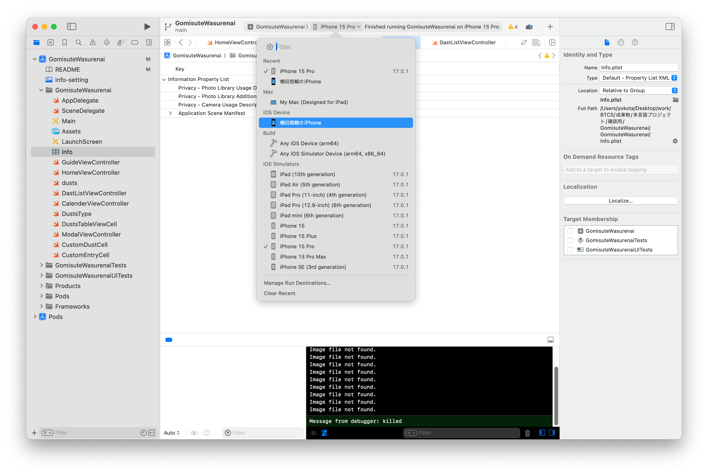

# GomisuteWasurenai

GomisuteWasurenaiは鳴海地区限定のゴミの分別アプリです。

以下の困り事を解決する為に開発しました。  
・何曜日が何ゴミを捨てるのかいまだに覚えられないので、スマホですぐに確認出来るようにしたい。  
・不燃ゴミの収集日が月1回しかなく、出し忘れてしまいゴミが溜まってしまう。  
・自宅の収納棚に貼ってある、分別マップをデジタル化したい。

# サービスの URL


# セットアップ方法

##### カメラ機能を使用しますので、お手元のiPhoneをMacへ接続して実機にBuildしてください。
##### 実機を使用しない場合カメラ機能が使えず、ゴミのデータ保存ができません。


1. App StoreからXcodeをインストールし、Xcodeの環境設定を行なってください。


2. CocoaPodsをインストールします。

```
sudo gem install cocoapods
```

3. CocoaPodsのインストールが完了したら、以下のコマンドを実行してください。

```
pod setup
```

4. SSH キーをコピーして、あなたの環境にクローンしてください。

```
git clone <SSH key>
```

5. cdコマンドでクローンしたファイルへ移動します。

```
cd GomisuteWasurenai 
```

6. openコマンドで.xcworkspaceファイルを開きます。

```
open GomisuteWasurenai.xcworkspace
```

7. あなたのiPhoneにアプリをインストールしてください。
参考サイト:<https://tech.amefure.com/swift-iphone>


8. あなたのiPhoneをMacにケーブル接続し、Buildをしてください。

